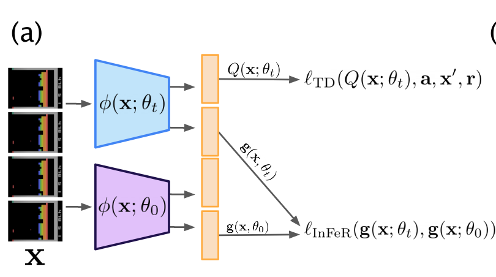

</img>

## InFeR DDQN

Pytorch reimplementation of [InFeR](https://arxiv.org/abs/2204.09560) (Understanding and Preventing Capacity Loss in Reinforcement Learning).  
InFeR adds multiple heads to the agent's feature extractor and regresses them on random predictions of the network's initialization parameters.  
It can be seen as predicting random value functions at each time step where the targets are generated by the network's parameters at step 0.  
Regularizing the feature representations of a deep RL agent in this way should help with nonstationarity and sparse rewards.

## Feature rank

The authors estimate the feature rank $\rho$ of an agent as the cardinality of the set of singular values of the feature extractor's *scaled* output that are greater than a threshold $\epsilon$:

$$
\hat{\rho}(\phi, \mathbf X, \epsilon) =  \Big| 
\{ \sigma \in \text{SVD} \Big( \frac{1}{\sqrt{n}} \phi(\mathbf X_n) \Big) \mid \sigma > \epsilon \}  \Big|~.
$$

Here:

- $\phi$ is the feature extractor.
- $\mathbf X$ is the dataset used (samples from the replay buffer).
- $\epsilon$ is a threshold set to $0.01~.$

For their plots, the authors are "*counting the number of singular values greater than 0.01 to get an estimate of the dimension of the network’s representation layer*" (page 20). Note that this doesn't include the scaling factor $\frac{1}{\sqrt{n}}~,$ which is also left out of the calculations in the code.

## Usage

1. Install the conda environment.
2. Start a single run with `python infer_dqn.py` or a batch of runs with `infer.sh`.

## Results

Due to computational constraints I've used Pong as test environment even though the paper reports the most significant gains on Montezuma's revenge.  
Returns roughly match those of the non-regularized agent, which confirms the paper's results.
Feature rank is indeed higher for InFeR .

Episodic Return             |  Feature rank
:-------------------------:|:-------------------------:
  |  

## Todo

- [ ] Try Huber loss/gradient clipping for InFeR agent
- [ ] Try double width agent

## Citations

Paper:

```bibtex
@article{lyle2022understanding,
  title={Understanding and preventing capacity loss in reinforcement learning},
  author={Lyle, Clare and Rowland, Mark and Dabney, Will},
  journal={arXiv preprint arXiv:2204.09560},
  year={2022}
}
```

Training code is based on [cleanRL](https://github.com/vwxyzjn/cleanrl):

```bibtex
@article{huang2022cleanrl,
  author  = {Shengyi Huang and Rousslan Fernand Julien Dossa and Chang Ye and Jeff Braga and Dipam Chakraborty and Kinal Mehta and João G.M. Araújo},
  title   = {CleanRL: High-quality Single-file Implementations of Deep Reinforcement Learning Algorithms},
  journal = {Journal of Machine Learning Research},
  year    = {2022},
  volume  = {23},
  number  = {274},
  pages   = {1--18},
  url     = {http://jmlr.org/papers/v23/21-1342.html}
}
```

Replay buffer and wrappers are from [Stable Baselines 3](https://github.com/DLR-RM/stable-baselines3):

```bibtex
@misc{raffin2019stable,
  title={Stable baselines3},
  author={Raffin, Antonin and Hill, Ashley and Ernestus, Maximilian and Gleave, Adam and Kanervisto, Anssi and Dormann, Noah},
  year={2019}
}
```
